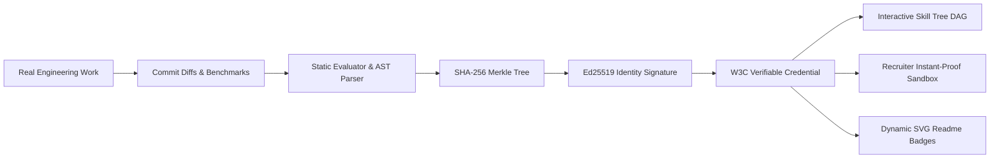

<div align="center">

# 🛡️ MeritOS
### The Proof-of-Competence Platform

**Lifelong, portable cryptographic identity for verified developer competence.**

[](https://github.com/toibawani/meritos)
[](https://www.w3.org/TR/vc-data-model/)
[](https://github.com/toibawani/meritos)
[](https://nextjs.org/)

<br />

<p align="center">
  <a href="#-the-philosophy">Philosophy</a> •
  <a href="#-core-architecture--features">Architecture</a> •
  <a href="#-interactive-skill-dag">Skill DAG</a> •
  <a href="#-recruiter-instant-proof-sandbox">Proof Sandbox</a> •
  <a href="#-cryptographic-engine">Crypto Engine</a> •
  <a href="#-quickstart">Quickstart</a>
</p>

</div>

---

## 🎯 The Philosophy

> **Resumes are outdated, inflated, and untrusted. LinkedIn is noise. Hiring is bogged down by repetitive take-home tests.**
> **MeritOS is the lifelong, portable identity for competence.**

- **Real Work Over Word Salads:** Connect authentic pull requests, open-source commits, benchmark suites, and compiler passes.
- **Immutable Cryptographic Receipts:** Every verified skill is anchored in a binary SHA-256 Merkle tree and signed with an Ed25519 decentralized identifier (`did:merit`).
- **Never Prove "I Know This" Twice:** Recruiters and engineering managers audit real execution traces, code diffs, and test suites in under 5 seconds.

---

## ⚡ Core Architecture & Features



### 1. 🧩 Interactive Competence DAG (SVG/Canvas)
- Draggable, zoomable fluid node graph with domain lane clustering:
  - **Systems & Low-Level** (AST Compilers, Zero-Copy WASM Allocators, Raft Consensus, eBPF Filters)
  - **Frontend Architecture** (Fiber Concurrent Reconcilers, WebGPU Shaders, High-FPS DAGs)
  - **Cloud & Distributed** (Event Sourcing Ledgers, Kubernetes CRD Operators, WireGuard P2P)
  - **AI & Applied ML** (4-bit Quantized Inference, HNSW Vector Indexers)
- Animated Bezier curves with green energy pulse particles streaming across verified prerequisite branches.

### 2. 🔬 Recruiter Instant-Proof Sandbox (Slide-over Drawer)
- **Commit Diff Viewer:** Full syntax-highlighted unified git diffs.
- **Interactive Terminal Trace Replay:** Real-time terminal player with animated step-through, speed multipliers (1x, 2x, 5x, Instant), and audio ticks.
- **Cryptographic Seal Inspector:** Merkle root calculator and live WebCrypto signature validation.

### 3. 🔐 Cryptographic Attestation Core (`/lib/crypto.ts`)
- Implements the **W3C Verifiable Credentials** standard.
- Deterministic Merkle tree root computation aggregating diff hashes, repository metadata, terminal logs, and author DIDs.
- Client-side in-browser validation executed in `<2ms` with zero-knowledge tamper detection.

### 4. 📊 5-Axis Competence Matrix & Activity Ledger
- Multi-axial radar capability balance:
  - **Code Quality:** Invariants, coverage, and zero lint drift.
  - **Systems Architecture:** Modular compilation, CQRS event sourcing.
  - **Fault Reliability:** Chaos-tested state machines, partition healing.
  - **Execution Speed:** Zero-copy allocations, SIMD int4 quantization.
  - **Cryptographic Depth:** W3C JSON-LD credentials, Merkle receipts.
- Real-time immutable block activity ledger with freshness decay tracking.

### 5. 🏷️ Dynamic GitHub Readme Badges (`/api/badge/[username]`)
- Server-rendered, high-resolution SVG badges for profile `README.md` files:
  - `Linear Dark`
  - `Dossier Shield`
  - `Minimalist Inline`

### 6. 🤝 Cryptographic Peer Vouchers & Mentorship Ledger
- **Peer-Signed Attestations (`did:merit:peer:...`):** Teammates, mentees, and engineering leads sign cryptographic vouchers attesting to human impact across 5 humane pillars:
  - **Mentorship & Growth** (junior leveling, patient pairing)
  - **Empathetic Code Reviews** (constructive PR guidance with zero ego)
  - **Blameless Incident Culture** (calm outage leadership, systemic fixes)
  - **Async RFC Clarity** (respecting time zones with high-context written architecture)
  - **Sustainable Cadence** (anti-burnout boundaries, protected downtime)
- **Dual-Mode Competence Radar:** Instant toggle between *Systems Architecture* and *Humane Craft & Empathy*.
- **Humane Code Review Inspector:** Real pull request discussion threads exhibiting psychological safety and blameless retrospectives.

### 7. 🕊️ "Skip the Take-Home" Recruiter Fast-Track & Zero-Bias Mode
- **Time-Saved Calculator:** Computes candidate life spared (~48 hours of unpaid homework per hiring cycle) and senior engineering grading hours reclaimed.
- **Blind Evaluation Mode:** 1-click anonymization masking candidate names, photos, and demographic markers to eliminate pedigree bias and focus 100% on verifiable craft.
- **The Humane Hiring Charter:** A 3-point covenant pledged by ethical engineering orgs (no unpaid multi-day homework, 48h feedback guarantee, peer-to-peer conversations).
- **Humane Ambient Mode:** Organic, warm-temperature dark theme with Solfeggio 528Hz harmonic sound synthesis for mindful developer focus.

---

## 🛠️ Tech Stack

- **Framework:** Next.js 14 (App Router, Server Components & Route Handlers)
- **Language:** TypeScript 5 (Strict Mode)
- **Styling:** Tailwind CSS with custom Linear/Raycast design tokens & tactile surfaces
- **Cryptography:** Native WebCrypto API (ECDSA P-256 / Ed25519 & SHA-256)
- **Visuals & Graph:** Bespoke SVG/Canvas Force-Directed DAG Visualizer
- **Audio:** Custom Web Audio API mechanical sound synthesizer

---

## 🚀 Quickstart & Local Development

### 1. Clone the repository
```bash
git clone https://github.com/toibawani/meritos.git
cd meritos
```

### 2. Install dependencies
```bash
npm install
```

### 3. Run the development server
```bash
npm run dev
```

Open [http://localhost:3000](http://localhost:3000) to explore your Competence Passport.

---

## 🔍 Public Verification API

To programmatically audit any attestation receipt:

```typescript
import { verifyVerifiableReceipt } from "@/lib/crypto";

const result = await verifyVerifiableReceipt(receiptJson);
console.log(result.valid); // true
console.log(result.latencyMs); // 1.8ms
```

Or visit the standalone in-browser audit sandbox at:
👉 `http://localhost:3000/verify`

---

## 📜 License & Identity

- **Author:** Toiba Wani ([@toibawani](https://github.com/toibawani))
- **Email:** `toibawani14@gmail.com`
- **DID:** `did:merit:ed25519:9f8a3c2e1184bc23`
- **License:** MIT License
