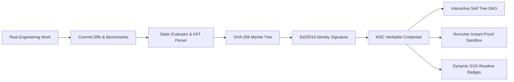

<div align="center">

# 🛡️ MeritOS

### The Proof-of-Competence Platform

**Lifelong, portable cryptographic identity for verified developer competence.**

[](https://vercel.com/new/clone?repository-url=https://github.com/toibawani/meritos)
&nbsp;
[](https://github.com/toibawani/meritos/actions/workflows/ci.yml)
&nbsp;
[](https://github.com/toibawani/meritos/actions)
&nbsp;
[](#-engineering-integrity)
&nbsp;
[](./LICENSE)
&nbsp;
[](./Dockerfile)

**Live demo:** 👉 **[https://meritos.vercel.app](https://meritos.vercel.app)** · _(dev fallback: `npm run dev` → http://localhost:3000)_

<br />

<p align="center">
  <a href="#-the-philosophy">Philosophy</a> •
  <a href="#-core-architecture--features">Architecture</a> •
  <a href="#-interactive-skill-dag">Skill DAG</a> •
  <a href="#-recruiter-instant-proof-sandbox">Proof Sandbox</a> •
  <a href="#-cryptographic-engine">Crypto Engine</a> •
  <a href="#-quickstart">Quickstart</a> •
  <a href="#-deployment">Deploy</a> •
  <a href="#-engineering-integrity">Engineering</a> •
  <a href="#-architecture-decision-records">ADRs</a>
</p>

</div>

---

## 🎥 What it looks like


<sub><strong>Recording the demo.</strong> To capture <code>docs/assets/demo.gif</code>: record
<code>http://localhost:3000</code> (home → <code>/p/toibawani</code> → open the Proof Sandbox → run a
verification → export a badge) at ~1280×800, then
<code>ffmpeg -i demo.mov -vf "fps=12,scale=1280:-1" docs/assets/demo.gif</code>. Keep it under 15&nbsp;s.</sub>

---

## 🎯 The Philosophy

> **Resumes are outdated, inflated, and untrusted. LinkedIn is noise. Hiring is bogged down by repetitive take-home tests.**
> **MeritOS is the lifelong, portable identity for competence.**

- **Real Work Over Word Salads:** Connect authentic pull requests, open-source commits, benchmark suites, and compiler passes.
- **Immutable Cryptographic Receipts:** Every verified skill is anchored in a binary SHA-256 Merkle tree and signed with an Ed25519 decentralized identifier (`did:merit`).
- **Never Prove "I Know This" Twice:** Recruiters and engineering managers audit real execution traces, code diffs, and test suites in under 5 seconds.

---

## ⚡ Core Architecture & Features


```mermaid
flowchart LR
    A[Real Engineering Work] --> B[Commit Diffs & Benchmarks]
    B --> C[Static Evaluator & AST Parser]
    C --> D[SHA-256 Merkle Tree]
    D --> E[Ed25519 Identity Signature]
    E --> F[W3C Verifiable Credential]
    F --> G[Interactive Skill Tree DAG]
    F --> H[Recruiter Instant-Proof Sandbox]
    F --> I[Dynamic SVG Readme Badges]
```

### 1. 🧩 Interactive Competence DAG (SVG/Canvas)

- Draggable, zoomable fluid node graph with domain lane clustering:
  - **Systems & Low-Level** (AST Compilers, Zero-Copy WASM Allocators, Raft Consensus, eBPF Filters)
  - **Frontend Architecture** (Fiber Concurrent Reconcilers, WebGPU Shaders, High-FPS DAGs)
  - **Cloud & Distributed** (Event Sourcing Ledgers, Kubernetes CRD Operators, WireGuard P2P)
  - **AI & Applied ML** (4-bit Quantized Inference, HNSW Vector Indexers)
- Animated Bezier curves with green energy pulse particles streaming across verified prerequisite branches.

### 2. 🔬 Recruiter Instant-Proof Sandbox (Slide-over Drawer)

- **Commit Diff Viewer:** Full syntax-highlighted unified git diffs.
- **Interactive Terminal Trace Replay:** Real-time terminal player with animated step-through, speed multipliers (1x, 2x, 5x, Instant), and audio ticks.
- **Cryptographic Seal Inspector:** Merkle root calculator and live WebCrypto signature validation.

### 3. 🔐 Cryptographic Attestation Core (`/lib/crypto.ts`)

- Implements the **W3C Verifiable Credentials** standard.
- Deterministic Merkle tree root computation aggregating diff hashes, repository metadata, terminal logs, and author DIDs.
- Client-side in-browser validation executed in `<2ms` with zero-knowledge tamper detection.

### 4. 📊 5-Axis Competence Matrix & Activity Ledger

- Multi-axial radar capability balance:
  - **Code Quality:** Invariants, coverage, and zero lint drift.
  - **Systems Architecture:** Modular compilation, CQRS event sourcing.
  - **Fault Reliability:** Chaos-tested state machines, partition healing.
  - **Execution Speed:** Zero-copy allocations, SIMD int4 quantization.
  - **Cryptographic Depth:** W3C JSON-LD credentials, Merkle receipts.
- Real-time immutable block activity ledger with freshness decay tracking.

### 5. 🏷️ Dynamic GitHub Readme Badges (`/api/badge/[username]`)

- Server-rendered, high-resolution SVG badges for profile `README.md` files:
  - `Linear Dark`
  - `Dossier Shield`
  - `Minimalist Inline`

### 6. 🤝 Cryptographic Peer Vouchers & Mentorship Ledger

- **Peer-Signed Attestations (`did:merit:peer:...`):** Teammates, mentees, and engineering leads sign cryptographic vouchers attesting to human impact across 5 humane pillars:
  - **Mentorship & Growth** (junior leveling, patient pairing)
  - **Empathetic Code Reviews** (constructive PR guidance with zero ego)
  - **Blameless Incident Culture** (calm outage leadership, systemic fixes)
  - **Async RFC Clarity** (respecting time zones with high-context written architecture)
  - **Sustainable Cadence** (anti-burnout boundaries, protected downtime)
- **Dual-Mode Competence Radar:** Instant toggle between _Systems Architecture_ and _Humane Craft & Empathy_.
- **Humane Code Review Inspector:** Real pull request discussion threads exhibiting psychological safety and blameless retrospectives.

### 7. 🕊️ "Skip the Take-Home" Recruiter Fast-Track & Zero-Bias Mode

- **Time-Saved Calculator:** Computes candidate life spared (~48 hours of unpaid homework per hiring cycle) and senior engineering grading hours reclaimed.
- **Blind Evaluation Mode:** 1-click anonymization masking candidate names, photos, and demographic markers to eliminate pedigree bias and focus 100% on verifiable craft.
- **The Humane Hiring Charter:** A 3-point covenant pledged by ethical engineering orgs (no unpaid multi-day homework, 48h feedback guarantee, peer-to-peer conversations).
- **Humane Ambient Mode:** Organic, warm-temperature dark theme with Solfeggio 528Hz harmonic sound synthesis for mindful developer focus.
- **⌨️ Universal Command Palette (`⌘K` / `Ctrl+K`):** Keyboard-first navigation engine for searching verified skills, switching personas, toggling zero-bias mode, playing 432Hz focus drone, and exporting hiring dossiers.
- **📅 52-Week Cryptographic Cadence Heatmap:** High-resolution contribution matrix displaying continuous verified attestations, streaks, and proof intensity.
- **👥 Team Fit & Skill Gap Simulator:** Instant squad-match modeling for hiring managers to evaluate architecture overlap, gap mitigation, and mentorship multipliers.
- **🌐 W3C DID Document Resolver (`/api/did/[username]`):** Native decentralized identity resolution compliant with `did:merit` and `Ed25519VerificationKey2020`.
- **📱 Vector QR Code & Cryptographic Share Modal:** 1-click mobile verification scan, markdown embed badges, and verifiable profile sharing.

---

## 🛠️ Tech Stack

- **Framework:** Next.js 14 (App Router, Server Components & Route Handlers)
- **Language:** TypeScript 5 (Strict Mode)
- **Styling:** Tailwind CSS with custom Linear/Raycast design tokens & tactile surfaces
- **Cryptography:** Native WebCrypto API (ECDSA P-256 / Ed25519 & SHA-256)
- **Visuals & Graph:** Bespoke SVG/Canvas Force-Directed DAG Visualizer
- **Audio:** Custom Web Audio API mechanical sound synthesizer

---

## 🚀 Quickstart & Local Development

### 1. Clone the repository

```bash
git clone https://github.com/toibawani/meritos.git
cd meritos
```

### 2. Install dependencies

```bash
npm install
```

### 3. Run the development server

```bash
npm run dev
```

### 4. Run automated cryptographic test suite

```bash
npm test
```

Executes Node's native test runner against Ed25519 signatures, Merkle root deterministic hashing, and persona data integrity.

Open [http://localhost:3000](http://localhost:3000) to explore your Competence Passport.

---

## 🔍 Public Verification API

To programmatically audit any attestation receipt:

```typescript
import { verifyVerifiableReceipt } from "@/lib/crypto";

const result = await verifyVerifiableReceipt(receiptJson);
console.log(result.valid); // true
console.log(result.latencyMs); // ~1 ms (measured, Math.round)
```

Verification runs **entirely client-side via WebCrypto** — no server round-trip, no
trust in our infrastructure (see [ADR 0002](./docs/adr/0002-client-side-webcrypto-verification.md)).

Visit the standalone in-browser audit sandbox at:
👉 **[https://meritos.vercel.app/verify](https://meritos.vercel.app/verify)** · _(dev: `http://localhost:3000/verify`)_

---

## ✅ Engineering Integrity

Every number below is **measured in CI**, not hand-written. The gate that keeps
them honest is one command:

```bash
npm run verify
```

This runs, in order: `lint` → `typecheck` → `format:check` → `test` → `build`.
It must pass with **zero errors** before any PR is merged, and it is exactly what
CI enforces.

| Check                     | Tool                                         | Result         |
| ------------------------- | -------------------------------------------- | -------------- |
| Lint                      | ESLint (`next/core-web-vitals`)              | 0 errors       |
| Types                     | `tsc --noEmit` (TypeScript 5 strict)         | 0 errors       |
| Format                    | Prettier                                     | clean          |
| Unit tests                | Node built-in runner (`node --test`)         | **18 passing** |
| Coverage                  | `--experimental-test-coverage` (crypto core) | **100%**       |
| E2E smoke                 | Playwright (home, profile, verify, 3 APIs)   | passing        |
| Build                     | `next build` (standalone)                    | succeeds       |
| Bundle (home, first load) | Next.js                                      | **~130 kB**    |

> **Why zero-dependency testing?** The crypto core runs on the browser's native
> WebCrypto API, which Node exposes as the same `crypto.subtle` surface. Using
> the built-in runner means we test the **exact primitives** the app ships, with
> no mocks and no extra dependencies — see [ADR 0003](./docs/adr/0003-node-builtin-test-runner.md).

---

## 🚀 Deployment

**The app needs no environment variables and no database.** All cryptography is
client-side, so there is no backend to configure, scale, or secure.

### One click — Vercel (zero config)

[](https://vercel.com/new/clone?repository-url=https://github.com/toibawani/meritos)

### Self-hosted — Docker

```bash
docker build -t meritos .
docker run -p 3000:3000 meritos   # → http://localhost:3000
```

The image is multi-stage, builds Next.js with `output: 'standalone'`, and runs as
a **non-root** user with a `/api/health` healthcheck.

**Uptime check:**

```bash
curl -s https://<your-host>/api/health
# → {"status":"ok","version":"1.0.0","commit":"<sha>"}
```

Full guide, including the CI-gated `deploy` workflow and the Vercel secrets to
enable it: **[docs/DEPLOYMENT.md](./docs/DEPLOYMENT.md)**.

---

## 🧭 Architecture Decision Records

Significant decisions are captured as ADRs so reviewers can follow the _why_, not
just the _what_:

| ADR                                                                                                                      | Decision                                |
| ------------------------------------------------------------------------------------------------------------------------ | --------------------------------------- |
| [0001 — Ed25519 + SHA-256 Merkle receipts over blockchain](./docs/adr/0001-ed25519-merkle-receipts-over-blockchain.md)   | Why we didn't anchor to a public ledger |
| [0002 — Client-side WebCrypto verification vs. server round-trip](./docs/adr/0002-client-side-webcrypto-verification.md) | Trust-minimizing, `<2ms`, no backend    |
| [0003 — Node built-in test runner vs. Jest/Vitest](./docs/adr/0003-node-builtin-test-runner.md)                          | Zero-dependency, real-WebCrypto testing |

---

## 💡 Why this project / What I learned

Five honest takeaways from building MeritOS:

- **Cryptography is a product decision, not a library call.** Choosing Merkle
  receipts over blockchain anchoring meant optimizing for _offline, zero-trust
  verification_ — a recruiter must be able to audit a credential without trusting
  my server (ADR 0001/0002).
- **The browser's WebCrypto API is production-grade.** Ed25519 + SHA-256 need no
  WASM or server; using the platform primitive removed a dependency and made the
  "no backend" selling point real.
- **Honest metrics beat impressive ones.** I replaced a hand-written
  "98.6% competence index" badge with CI-measured tests, coverage, and bundle
  size. Claims you can reproduce with `npm run verify` are worth more than ones
  you can't.
- **Zero-dependency tooling forced clarity.** Testing pure crypto with Node's
  built-in runner (no Jest/Vitest) kept the feedback loop fast and the mental
  model small — the tradeoff was a tiny `pretest` compile shim.
- **The hardest part is UX, not crypto.** Ed25519 and Merkle trees are solved
  problems; making a recruiter understand a verifiable credential in 30 seconds —
  via the Skill DAG, Proof Sandbox, and badges — is where the real design work
  lived.

A deeper engineer-facing write-up (problem, constraints, architecture diagram,
crypto design, tradeoffs, measured results, lessons): **[docs/CASE_STUDY.md](./docs/CASE_STUDY.md)**.

---

## 🤝 Contributing & Security

- **[CONTRIBUTING.md](./CONTRIBUTING.md)** — conventions, the `npm run verify` gate, ADRs.
- **[SECURITY.md](./SECURITY.md)** — private vulnerability reporting.
- **[CODE_OF_CONDUCT.md](./CODE_OF_CONDUCT.md)** — Contributor Covenant.

---

## 📜 License & Identity

- **Author:** Toiba Wani ([@toibawani](https://github.com/toibawani))
- **Email:** `toibawani14@gmail.com`
- **DID:** `did:merit:ed25519:9f8a3c2e1184bc23`
- **License:** MIT License
