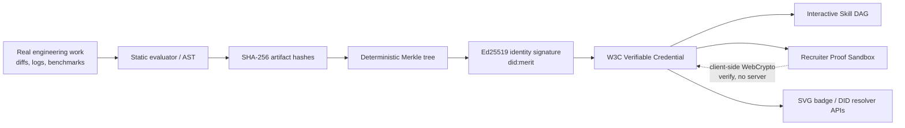

# Case Study: MeritOS — A Proof-of-Competence Platform

**Author:** Toiba Wani · **Stack:** Next.js 14 (App Router) · TypeScript 5 strict · Tailwind · native WebCrypto
**Repo:** https://github.com/toibawani/meritos · **Live:** https://meritos.vercel.app

---

## 1. Problem

Hiring for senior engineering roles leans on artifacts that are easy to inflate
(resumes, self-reported skill lists) and expensive to evaluate (multi-day take-home
tests). The friction is real on both sides: candidates spend unpaid hours proving
competence they can't portably prove again, and recruiters re-derive signal from
noisy profiles.

**Goal:** a lifelong, portable, cryptographically verifiable identity for
developer competence — one where a recruiter can audit a claimed skill against a
real, tamper-evident receipt **in seconds, without trusting my server**.

## 2. Constraints

- **Zero backend.** No database, no secrets, no environment variables. All
  crypto in the browser. This had to be a genuine property, not marketing.
- **Stack discipline.** Next.js / TypeScript / Tailwind / the Node built-in test
  runner only. No new frameworks except an explicitly allowed linter, Playwright,
  and a coverage tool.
- **Honesty.** No fabricated metrics or badges. Every number quoted here and in
  the README is reproducible via `npm run verify`.

## 3. Architecture

Key routes: `/` (passport home), `/p/[username]` (persona profile), `/verify`
(audit sandbox), `/api/badge/[username]` (SVG), `/api/did/[username]`
(DID document), `/api/health` (liveness).

## 4. Crypto design

- **Hashing:** SHA-256 over each artifact (commit diff, repo metadata, terminal
  logs), aggregated by a **binary Merkle tree** into one signed root. A verifier
  checks a single leaf against the root without the full artifact set.
- **Identity:** Ed25519 keypairs generated in-browser; the public key is published
  as a `did:merit` document with `Ed25519VerificationKey2020`.
- **Credentials:** W3C Verifiable Credentials (`VerifiableCredential`,
  `JsonWebSignature2020`), canonical-subject signing.
- **Selective disclosure / ZK:** `lib/zkProof.ts` issues hash commitments so a
  skill level can be asserted ("≥ Expert") without revealing the exact score.
- **Why not blockchain anchoring:** see [ADR 0001](../adr/0001-ed25519-merkle-receipts-over-blockchain.md)
  — offline, zero-trust, zero-cost verification beats a consensus oracle for this
  threat model.

## 5. Tradeoffs

| Decision              | Chose                         | Over              | Because                                                                                                           |
| --------------------- | ----------------------------- | ----------------- | ----------------------------------------------------------------------------------------------------------------- |
| Verification location | Client-side WebCrypto         | Server round-trip | No trust dependency on my infra; <2ms; no backend ([ADR 0002](../adr/0002-client-side-webcrypto-verification.md)) |
| Integrity primitive   | Ed25519 + Merkle receipts     | Blockchain        | Offline, free, reviewable ([ADR 0001](../adr/0001-ed25519-merkle-receipts-over-blockchain.md))                    |
| Test runner           | Node built-in (`node --test`) | Jest/Vitest       | Zero-dep, real WebCrypto, native coverage ([ADR 0003](../adr/0003-node-builtin-test-runner.md))                   |

## 6. Measured results

All numbers come from CI / `npm run verify` on a clean `npm ci`:

| Metric                          | Value                     | Source                                |
| ------------------------------- | ------------------------- | ------------------------------------- |
| Unit tests                      | **18 passing, 0 failing** | `node --test tests/*.test.mjs`        |
| Coverage (crypto core)          | **100%** (lines/branches) | `--experimental-test-coverage`        |
| Lint / typecheck                | **0 errors**              | `next lint` · `tsc --noEmit` (strict) |
| Credential verification latency | **~1 ms** (measured)      | `verifyVerifiableReceipt().latencyMs` |
| Home route first-load JS        | **~130 kB**               | `next build` route table              |
| Docker image                    | multi-stage, **non-root** | `Dockerfile` (`output: 'standalone'`) |
| Env vars required               | **0**                     | client-side crypto, no DB             |

## 7. Lessons learned

1. **Crypto is a product decision.** The Merkle-vs-blockchain and
   client-vs-server choices were driven by the promise ("verify without trusting
   me"), not by which library was easiest.
2. **Platform primitives are production-grade.** Native WebCrypto removed a
   dependency and made the "no backend" claim real rather than aspirational.
3. **Honest, reproducible metrics are the strongest signal.** Replacing a
   fabricated "98.6% competence index" badge with CI-measured tests, coverage,
   and bundle size made the repo more credible, not less impressive.
4. **Zero-dependency tooling sharpened focus.** Testing pure crypto with the
   built-in runner kept the loop fast and the surface small; the cost was one
   small `pretest` compile shim.
5. **The hard part is the 30-second explanation.** The crypto is solved; making a
   recruiter grasp a verifiable credential quickly is where the design effort
   concentrated (Skill DAG, Proof Sandbox, badges).
